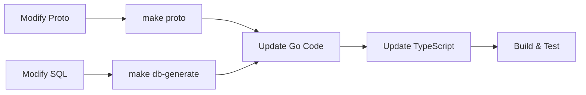

# Architecture Summary

Interactive overview of Weladee Form architecture.

## System Overview

```mermaid
graph TB
    subgraph "Frontend - Next.js 16"
        A[Form Builder<br/>app/(main)/dashboard]
        B[Form Player<br/>app/(form-player)/f/[slug]]
        C[Dashboard<br/>app/(main)/dashboard]
    end

    subgraph "Backend - Go gRPC"
        D[FormService<br/>internal/gapi/rpc_form.go]
        E[ResponseService<br/>internal/gapi/rpc_response.go]
        F[FileService<br/>internal/gapi/rpc_file.go]
        G[AnalyticsService<br/>internal/gapi/rpc_analytics_*.go]
        H[Auth Interceptor<br/>internal/auth/interceptor.go]
    end

    subgraph "Data Layer"
        I[(PostgreSQL<br/>sql/schema/)]
        J[S3/R2 Storage<br/>internal/storage/]
    end

    subgraph "Generated Code"
        K[Protobuf<br/>proto/pb/*.pb.go]
        L[SQLC<br/>internal/db/sqlc/]
    end

    A -->|gRPC-Web| D
    C -->|gRPC-Web| D
    B -->|gRPC-Web| E
    B -->|gRPC-Web| F

    D -.->H
    E -.->H
    F -.->H
    G -.->H

    D -->|SQLC| L
    E -->|SQLC| L
    G -->|SQLC| L

    L -->|pgx| I
    F -->|AWS SDK| J

    K -.->D
    K -.->E
    K -.->F
    K -.->G

    style A fill:#e1f5fe
    style B fill:#e1f5fe
    style C fill:#e1f5fe
    style D fill:#fff3e0
    style E fill:#fff3e0
    style F fill:#fff3e0
    style G fill:#fff3e0
    style H fill:#ffebee
    style I fill:#e8f5e9
    style J fill:#e8f5e9
    style K fill:#f3e5f5
    style L fill:#f3e5f5
```

## Technology Stack

| Layer | Technology | Purpose |
|-------|-----------|---------|
| **Frontend** | Next.js 16 + React 19 | App Router, Server Components |
| **Backend** | Go 1.21+ | gRPC services |
| **Protocol** | Connect RPC (gRPC-Web) | Browser-to-server communication |
| **Serialization** | Protobuf v3 | Type-safe API contracts |
| **Database** | PostgreSQL 15+ | Persistent storage |
| **ORM** | SQLC | Type-safe SQL generation |
| **Storage** | S3 / R2 | File uploads |

## Key Features

| Feature | Implementation |
|---------|---------------|
| **Form Builder** | Drag-and-drop editor with 15 question types |
| **Form Player** | One-question-at-a-time with 4 progress styles |
| **Themes** | 10 preset themes (minimal, midnight, ocean, etc.) |
| **Progress Bars** | None, linear, steps, circular |
| **Analytics** | View tracking, response stats, trends |
| **Exports** | CSV, JSON (all), Excel (Enterprise) |
| **Auth** | JWT (RS256) with customer type enforcement |
| **File Uploads** | Streaming via S3/R2 (Enterprise only) |

## Customer Types

| Feature | SME | Standard | Enterprise |
|---------|-----|----------|------------|
| Max Forms | 5 | 15 | Unlimited |
| File Uploads | ❌ | ❌ | ✅ |
| Matrix Questions | ❌ | ✅ | ✅ |
| Ranking Questions | ❌ | ❌ | ✅ |
| Company Branding | ❌ | ❌ | ✅ |
| Excel Export | ❌ | ❌ | ✅ |

## Quick Links

- [System Context](./01-system-context.md) - C4 Level 1 diagram
- [Container Architecture](./02-containers.md) - C4 Level 2 diagram
- [Component Architecture](./03-components.md) - C4 Level 3 diagram
- [Data Model](./04-data-model.md) - Database schema and ER diagrams
- [Security Architecture](./05-security.md) - Auth and security details
- [Quality Attributes](./06-quality-attributes.md) - Performance and scalability
- [Deployment Architecture](./07-deployment.md) - Deployment options
- [gRPC Services](./api/grpc-services.md) - API documentation
- [ADRs](./adr/) - Architecture Decision Records

## Architecture Decision Records

1. [gRPC over REST](./adr/001-grpc-over-rest.md) - Why we chose gRPC
2. [SQLC over ORM](./adr/002-sqlc-over-orm.md) - Type-safe database access
3. [Next.js App Router](./adr/003-nextjs-app-router.md) - React Server Components
4. [Protobuf Types](./adr/004-protobuf-types.md) - End-to-end type safety
5. [Connect Protocol](./adr/005-connect-protocol.md) - Browser gRPC implementation

## Development Workflow



## File Structure

```
weladee-form/
├── proto/                    # gRPC definitions
│   ├── form.proto
│   ├── response.proto
│   ├── file.proto
│   └── analytics.proto
├── sql/
│   ├── schema/               # Database schema
│   │   └── form_schema.sql
│   └── queries/              # SQLC queries
│       ├── form.sql
│       ├── response.sql
│       └── analytics.sql
├── internal/
│   ├── gapi/                 # gRPC service implementations
│   │   ├── rpc_form.go
│   │   ├── rpc_response.go
│   │   ├── rpc_file.go
│   │   └── rpc_analytics_*.go
│   ├── auth/                 # Authentication
│   │   ├── interceptor.go
│   │   └── jwt.go
│   ├── db/                   # Database layer
│   │   └── sqlc/             # Generated code
│   └── storage/              # S3/R2 storage
│       └── s3.go
├── app/                      # Next.js App Router
│   ├── (main)/               # Authenticated routes
│   │   ├── dashboard/
│   │   └── forms/
│   └── (form-player)/        # Public routes
│       └── f/[slug]/
├── components/               # React components
│   ├── form-builder/         # Form editor
│   ├── form-player/          # Public form renderer
│   ├── responses/            # Response management
│   └── dashboard/            # Dashboard widgets
└── lib/                      # Utilities
    ├── grpc-client.ts        # gRPC client
    ├── proto/                # Generated TypeScript
    └── questions.ts          # Question type definitions
```

## Getting Started

### Prerequisites

- Go 1.21+
- Node.js 20+
- PostgreSQL 15+
- S3/R2 account (for file uploads)

### Development

```bash
# Backend
make dev

# Frontend
npm run dev
```

### Build

```bash
# Single binary (with embedded frontend)
make build-local

# Or Docker
docker build -t weladee-form .
```

### Documentation

For more detailed information, see:
- [CLAUDE.md](../../CLAUDE.md) - Project overview and development guide
- [Architecture Documentation](./) - This directory
- [API Documentation](./api/grpc-services.md) - gRPC service details

---

**Generated:** 2025-01-08
**Branch:** feature/grpc-migration
