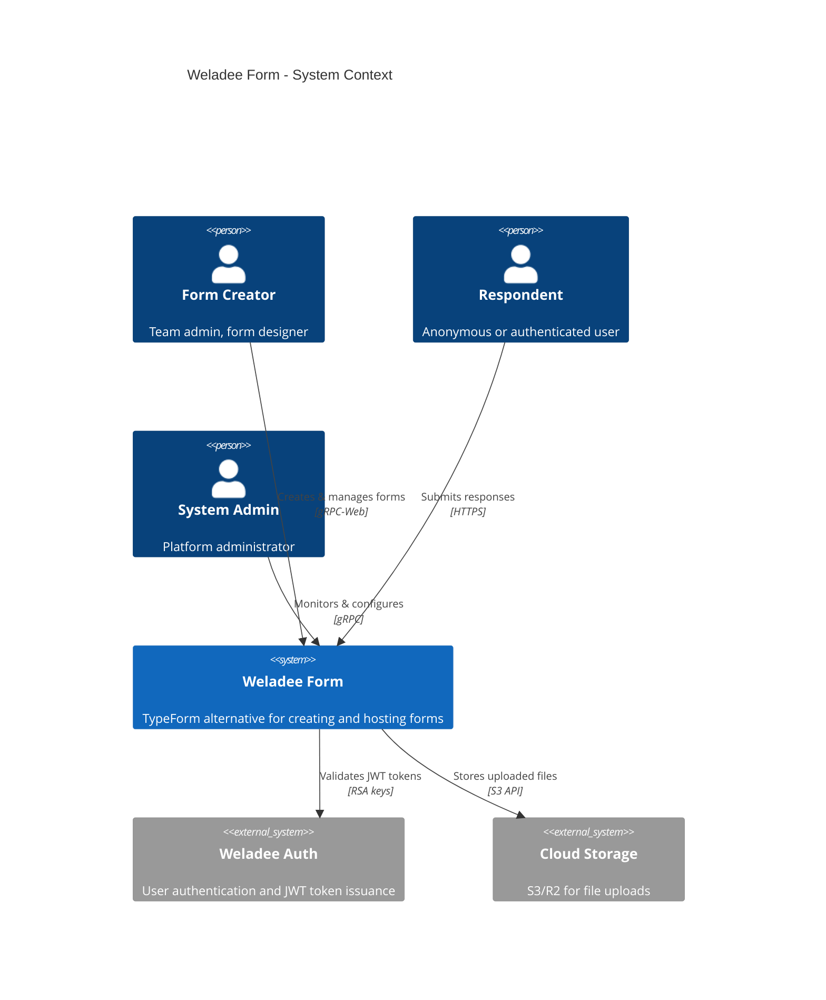
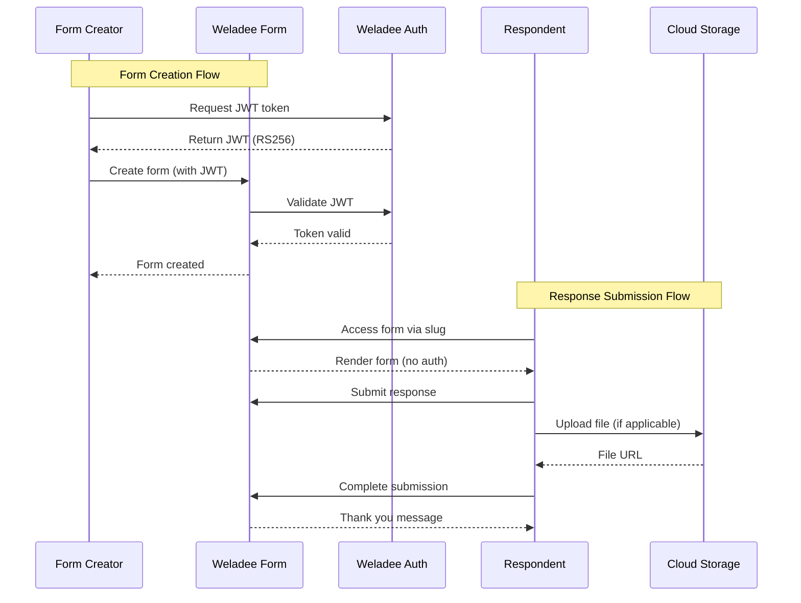

# System Context - C4 Level 1

**C4 Level:** System Context
**Scope:** Weladee Form system as a whole
**Audience:** All stakeholders

## Overview

The System Context diagram shows Weladee Form as a black box, its boundaries, and how it interacts with external users and systems.

## System Context Diagram

## User Personas

### 1. Form Creator

**Who:** Team administrators, form designers, business users

**Goals:**
- Create professional-looking forms quickly
- Customize form appearance with themes
- Control form access and response collection
- Analyze responses and export data

**Key Interactions:**
- Create forms with 15 question types
- Apply one of 10 visual themes
- Configure progress indicators (4 styles)
- Set customer type-based feature limits
- View real-time response analytics
- Export to CSV/JSON/Excel (Enterprise)

**Access Level:** Authenticated (JWT required)

### 2. Respondent

**Who:** End users filling out forms (public or authenticated)

**Goals:**
- Complete forms quickly and easily
- Clear visual feedback and progress indication
- Submit via mobile or desktop
- Optional: Save partial responses

**Key Interactions:**
- Access forms via unique slug
- One-question-at-a-time navigation
- Keyboard shortcuts (Enter, arrows)
- Mobile-responsive design
- File uploads (if enabled)

**Access Level:** Public (no auth required)

### 3. System Admin

**Who:** Platform operators, DevOps engineers

**Goals:**
- Monitor system health
- Manage configuration
- Control customer type limits
- Ensure security compliance

**Key Interactions:**
- Generate JWT tokens
- View analytics across all forms
- Configure database connections
- Manage storage credentials

**Access Level:** Authenticated (Admin role)

## External Systems

### Weladee Auth

**Purpose:** Centralized authentication service

**Responsibilities:**
- Issue JWT tokens (RS256)
- Provide RSA public keys for validation
- Manage user sessions

**Protocol:** JWT via RSA key pairs

**Integration:**
- Token validation in `internal/auth/jwt.go`
- Public endpoints bypass auth (see `internal/auth/interceptor.go`)

### Cloud Storage (S3/R2)

**Purpose:** File upload storage

**Responsibilities:**
- Store uploaded images and PDFs
- Generate presigned URLs for downloads
- Handle large file uploads efficiently

**Protocol:** AWS S3 API (via AWS SDK v2)

**Storage Location:** `internal/storage/s3.go`

## System Boundaries

### Inside the System

- Form creation and management
- Response collection and storage
- Analytics and reporting
- Theme rendering
- Progress indication
- File upload handling

### Outside the System

- User authentication (delegated to Weladee Auth)
- Email delivery (future integration)
- Payment processing (future integration)
- Third-party analytics (future integration)

## OpenAPI/Public Endpoints

The following endpoints are **public** (no authentication required):

1. `GET /f/[slug]` - View and submit a form
2. `FormService.GetFormBySlug` - Fetch form by slug
3. `ResponseService.SubmitResponse` - Submit a response
4. `AnalyticsService.TrackView` - Track form view
5. `AnalyticsService.TrackResponseStart` - Track form start

All other endpoints require a valid JWT token.

## Data Flow at Context Level

## Quality Attributes at Context Level

| Attribute | Target | How It's Achieved |
|-----------|--------|-------------------|
| **Availability** | 99.9% uptime | Stateless services, database connection pooling |
| **Security** | Data encryption at rest/in-transit | HTTPS, JWT validation, S3 encryption |
| **Performance** | <200ms API response | gRPC binary protocol, prepared statements |
| **Scalability** | 10,000 concurrent users | Horizontal scaling of Go servers |
| **Usability** | 60-second form completion | One-question-at-a-time, keyboard shortcuts |

---

**Next:** [Container Architecture (C4 Level 2)](./02-containers.md)
