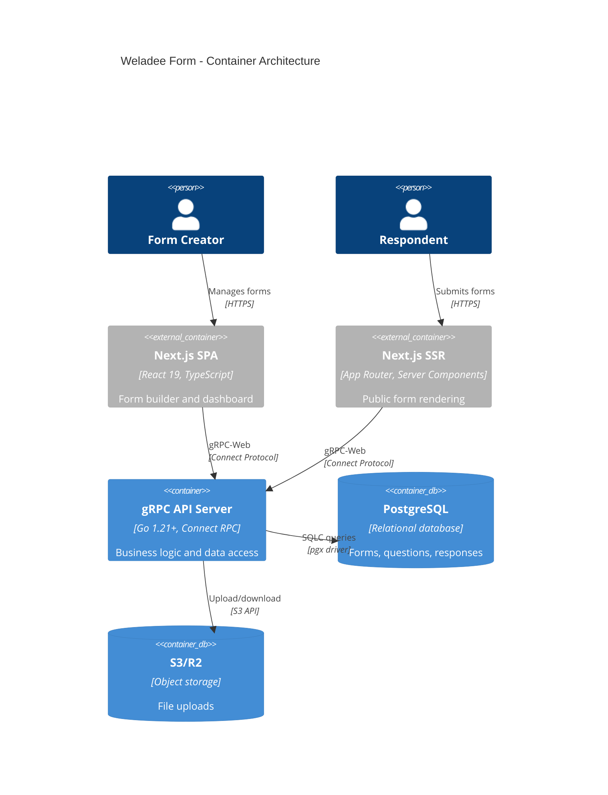
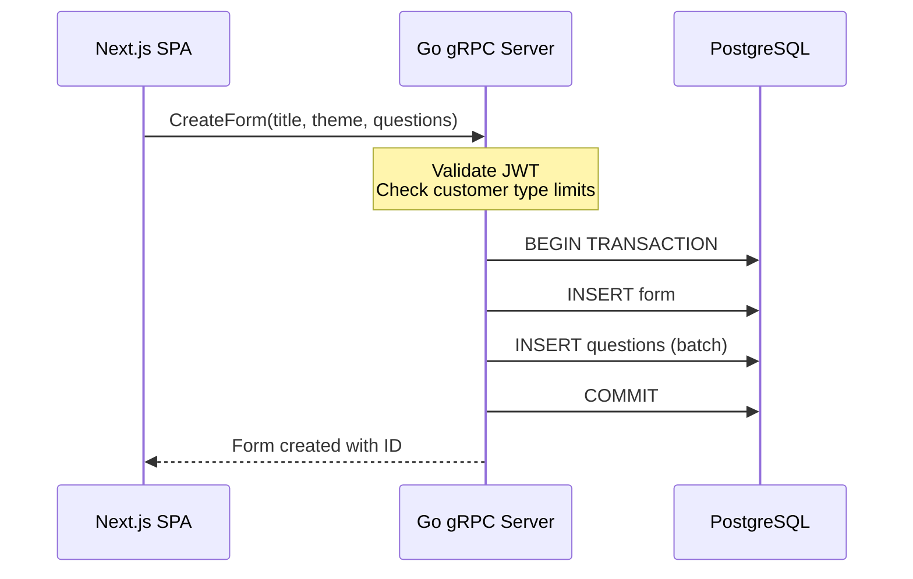
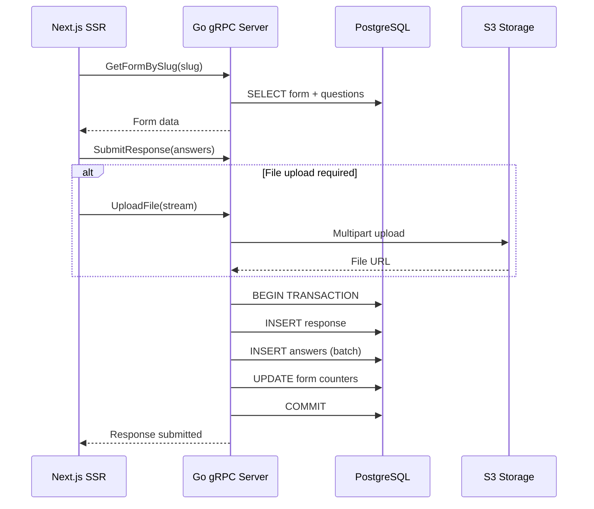

# Container Architecture - C4 Level 2

**C4 Level:** Container
**Scope:** Major applications/processes within Weladee Form
**Audience:** Architects, senior developers

## Overview

The Container diagram shows the major applications/services that make up Weladee Form and how they interact.

## Container Diagram



## Container Details

### 1. Next.js SPA (Single Page Application)

**Technology:** Next.js 16, React 19, TypeScript, Tailwind CSS 4

**Responsibilities:**
- Form builder with drag-and-drop question ordering
- Dashboard for form management
- Response viewing and filtering
- Analytics and export functionality
- Customer type enforcement (UI-level)

**Key Components:**
- `app/(main)/` - Authenticated routes (dashboard, form editor)
- `components/form-builder/` - Form creation UI
- `components/responses/` - Response management
- `components/dashboard/` - Dashboard widgets

**Communication:**
- Uses gRPC-Web via Connect RPC protocol
- Client in `lib/grpc-client.ts`
- Transport layer: `@bufbuild/connect-web`

**State Management:**
- React Server Components for data fetching
- Client state via React hooks (useState, useContext)
- URL state for filters and pagination

### 2. Next.js SSR (Server-Side Rendering)

**Technology:** Next.js 16 App Router, React Server Components

**Responsibilities:**
- Render public forms via unique slugs
- SEO-optimized form pages
- Progressive enhancement
- One-question-at-a-time navigation

**Key Components:**
- `app/(form-player)/f/[slug]/page.tsx` - Public form page
- `components/form-player/` - Form player components
- `components/progress-bar/` - Progress indicators (4 styles)

**Communication:**
- Public endpoints only (no auth)
- Calls `GetFormBySlug` to fetch form data
- Submits responses via `SubmitResponse`

**Special Features:**
- Keyboard navigation (Enter, arrow keys, scroll)
- Mobile-responsive design
- Partial save support (draft responses)

### 3. Go gRPC API Server

**Technology:** Go 1.21+, gRPC, Connect RPC, SQLC

**Responsibilities:**
- Form CRUD operations
- Question management
- Response collection and storage
- Analytics aggregation
- File upload handling
- JWT authentication
- Customer type enforcement

**Key Services:**
- `FormService` - Form and question management
- `ResponseService` - Response collection and export
- `FileService` - File upload streaming
- `AnalyticsService` - Views, starts, completions tracking

**Implementation:**
- `internal/gapi/rpc_form.go` - Form service
- `internal/gapi/rpc_response.go` - Response service
- `internal/gapi/rpc_file.go` - File service
- `internal/gapi/rpc_analytics_*.go` - Analytics

**Middleware:**
- `internal/auth/interceptor.go` - JWT validation
- Public method whitelist for anonymous access

### 4. PostgreSQL Database

**Technology:** PostgreSQL 15+, pgx/v5 driver

**Schema:** `form` schema with tables:
- `users` - Form users (linked to Weladee)
- `forms` - Form definitions
- `questions` - Form questions
- `responses` - Form submissions
- `answers` - Response answers
- `file_uploads` - File metadata
- `form_views` - View tracking
- `daily_stats` - Aggregated analytics

**Access Layer:**
- SQLC for type-safe queries
- `sql/queries/*.sql` - Query definitions
- `internal/db/sqlc/` - Generated code

**Indexes:**
- Foreign key indexes
- Query optimization indexes
- JSONB GIN indexes for settings

### 5. S3/R2 Object Storage

**Technology:** AWS S3 API (S3, Cloudflare R2, MinIO)

**Responsibilities:**
- Store uploaded files (images, PDFs)
- Generate presigned URLs for downloads
- Handle multipart uploads for large files

**Implementation:**
- `internal/storage/s3.go` - S3 client wrapper
- AWS SDK v2 for Go
- Streaming via gRPC

## Data Flow Between Containers

### Form Creation Flow



### Response Submission Flow



## Communication Protocols

### gRPC-Web over Connect Protocol

**Why Connect RPC?**
- Better TypeScript support than grpc-web
- Streaming support for file uploads
- Unary and streaming RPCs
- Compatible with standard gRPC services

**Transport:**
```typescript
// lib/grpc-client.ts
const transport = createGrpcWebTransport({
  baseUrl: process.env.NEXT_PUBLIC_GRPC_URL || "", // Same-origin for embedded
  interceptors: [authInterceptor, errorInterceptor]
});
```

### Database Access

**SQLC Pattern:**
```go
// Type-safe generated code
queries := db.New(db.conn)
form, err := queries.CreateForm(ctx, db.CreateFormParams{
    UserID:  userID,
    Title:   title,
    Theme:   theme,
    // ...
})
```

## Deployment Model

### Single Binary Deployment (Embedded)

```
┌─────────────────────────────────────────┐
│         weladee-form binary             │
│  ┌─────────────────────────────────────┐│
│  │  Go gRPC Server                     ││
│  │  - gRPC handlers                    ││
│  │  - Auth middleware                  ││
│  │  - Business logic                   ││
│  └─────────────────────────────────────┘│
│  ┌─────────────────────────────────────┐│
│  │  Embedded Next.js Build             ││
│  │  - Static HTML/JS/CSS               ││
│  │  - Server components                ││
│  │  - Client bundles                   ││
│  └─────────────────────────────────────┘│
└─────────────────────────────────────────┘
         │              │
         ▼              ▼
    PostgreSQL      S3/R2
```

**Benefits:**
- Single artifact to deploy
- No separate frontend build step
- Same-origin gRPC calls (no CORS)
- Simple Docker image

**Build Command:**
```bash
make build-local  # Creates bin/weladee-form
```

### Development Deployment

```
┌──────────────────┐         ┌──────────────────┐
│  npm run dev     │         │  go run server   │
│  Next.js dev     │◄───────►│  gRPC server     │
│  :3000           │ gRPC-Web│  :50051          │
└──────────────────┘         └──────────────────┘
         │                            │
         └────────────┬───────────────┘
                      ▼
                PostgreSQL + S3
```

## Container Interactions Summary

| From | To | Protocol | Purpose |
|------|-----|----------|---------|
| SPA | gRPC Server | Connect RPC (gRPC-Web) | Form management |
| SSR | gRPC Server | Connect RPC (gRPC-Web) | Public form access |
| gRPC Server | PostgreSQL | pgx/v5 (SQLC) | Data persistence |
| gRPC Server | S3/R2 | AWS SDK | File storage |
| SPA | SSR | HTTP navigation | User routing |

---

**Next:** [Component Architecture (C4 Level 3)](./03-components.md)
