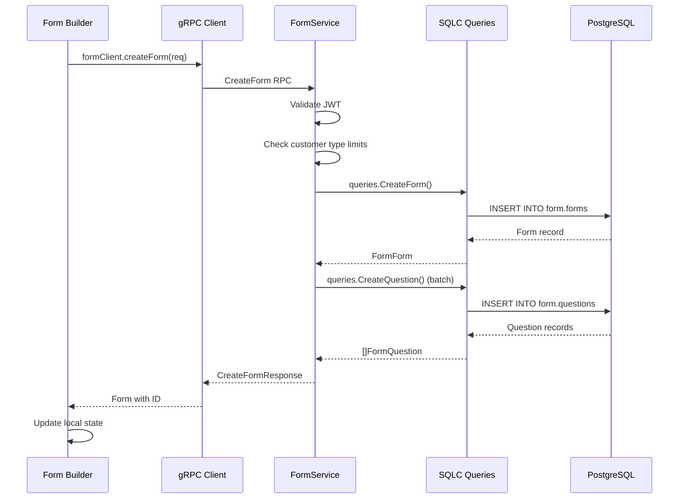
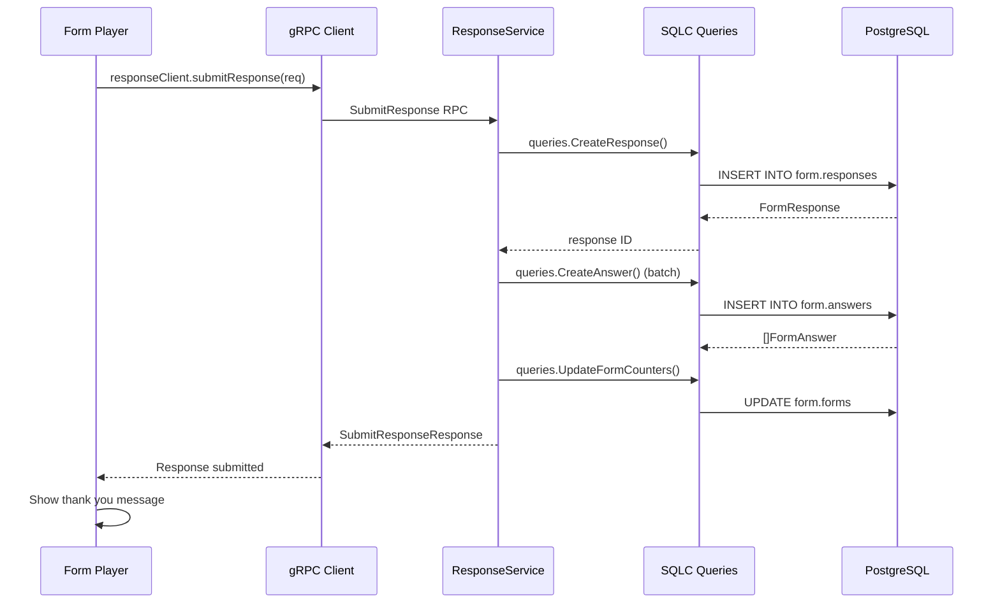

# Component Architecture - C4 Level 3

**C4 Level:** Component
**Scope:** Internal components of each container
**Audience:** Developers, implementers

## Overview

The Component diagrams show the internal structure of the major containers: the Go gRPC API Server and the Next.js frontend.

## Backend Components (Go gRPC Server)

```mermaid
C4Component
    title Go gRPC Server - Component Architecture

    Container(spa, "Next.js SPA")
    Container(ssr, "Next.js SSR")

    Component_DB(db, "PostgreSQL", "Database")

    Component(auth, "Auth Interceptor", "JWT validation, public method whitelist", "internal/auth/interceptor.go")
    Component(form_svc, "FormService", "Form CRUD operations", "internal/gapi/rpc_form.go")
    Component(response_svc, "ResponseService", "Response collection", "internal/gapi/rpc_response.go")
    Component(file_svc, "FileService", "File upload streaming", "internal/gapi/rpc_file.go")
    Component(analytics_svc, "AnalyticsService", "Tracking and aggregation", "internal/gapi/rpc_analytics_*.go")
    Component(storage, "Storage Layer", "S3/R2 client wrapper", "internal/storage/s3.go")
    Component(sqlc, "SQLC Queries", "Type-safe database access", "internal/db/sqlc/")

    Rel(spa, auth, "Authenticated requests", "gRPC-Web + JWT")
    Rel(ssr, auth, "Public requests", "gRPC-Web (no auth)")
    Rel(auth, form_svc, "Forward valid requests")
    Rel(auth, response_svc, "Forward valid requests")
    Rel(auth, file_svc, "Forward valid requests")
    Rel(auth, analytics_svc, "Forward all requests (public tracking)")

    Rel(form_svc, sqlc, "Query forms")
    Rel(response_svc, sqlc, "Query responses")
    Rel(analytics_svc, sqlc, "Query analytics")
    Rel(file_svc, storage, "Upload/download")

    Rel(sqlc, db, "Execute queries")
    Rel(storage, db, "Store file metadata")
```

### Backend Component Details

#### 1. Auth Interceptor

**File:** `internal/auth/interceptor.go`

**Responsibilities:**
- Extract JWT from `Authorization` header
- Validate token using RSA keys
- Add user claims to request context
- Whitelist public methods

**Key Methods:**
```go
func (i *AuthInterceptor) Unary() grpc.UnaryServerInterceptor
func (i *AuthInterceptor) Stream() grpc.StreamServerInterceptor
func NewConnectAuthInterceptor(validator) connect.UnaryInterceptorFunc
```

**Public Methods (No Auth Required):**
- `FormService.GetFormBySlug`
- `ResponseService.SubmitResponse`
- `AnalyticsService.TrackView`
- `AnalyticsService.TrackResponseStart`

**User Claims:**
```go
type WeladeeUserClaims struct {
    UserID        int32
    Email         string
    DisplayName   string
    CustomerType  string  // "sme" | "standard" | "enterprise"
    LogoURL       string  // Optional company branding
}
```

#### 2. FormService

**File:** `internal/gapi/rpc_form.go`

**RPC Methods:**
- `CreateForm` - Create form with initial questions
- `GetForm` - Fetch form by ID (with optional questions)
- `GetFormBySlug` - Fetch form by public slug (no auth)
- `UpdateForm` - Update form properties
- `DeleteForm` - Delete form and cascade
- `ListForms` - Paginated list with search/sort/filter
- `PublishForm` - Mark form as published, generate slug
- `GetFormStats` - Response counts

**Question Management:**
- `CreateQuestion` - Add question to form
- `UpdateQuestion` - Modify question
- `DeleteQuestion` - Remove question
- `ReorderQuestions` - Bulk reorder

**Customer Type Enforcement:**
```go
// Check form creation limit
func (s *FormService) CreateForm {
    count, _ := s.queries.CountUserForms(ctx, userID)
    maxForms := getMaxFormsForCustomerType(claims.CustomerType)
    if count >= maxForms {
        return error("form limit reached")
    }
}

// Check question type permissions
func (s *FormService) CreateQuestion {
    if req.Type == QUESTION_TYPE_FILE_UPLOAD {
        if claims.CustomerType != "enterprise" {
            return error("file upload requires enterprise")
        }
    }
}
```

#### 3. ResponseService

**File:** `internal/gapi/rpc_response.go`

**RPC Methods:**
- `SubmitResponse` - Submit or partially save
- `GetResponse` - Fetch single response
- `ListResponses` - Paginated list with filters
- `DeleteResponse` - Delete response
- `ExportResponses` - CSV/JSON/Excel export

**Export Logic:**
```go
func (s *ResponseService) ExportResponses {
    switch format {
    case "csv":
        return exportToCSV(responses)
    case "json":
        return exportToJSON(responses)
    case "excel":
        if claims.CustomerType != "enterprise" {
            return error("excel export requires enterprise")
        }
        return exportToExcel(responses)
    }
}
```

#### 4. FileService

**File:** `internal/gapi/rpc_file.go`

**RPC Methods:**
- `UploadFile` - Streaming upload with chunking
- `GetFileUrl` - Generate presigned download URL

**Upload Flow:**
1. Client initiates upload with metadata
2. Server streams chunks to S3
3. S3 returns file URL
4. Server saves metadata to `form.file_uploads`

#### 5. AnalyticsService

**Files:**
- `internal/gapi/rpc_analytics_tracking.go` - View/start tracking
- `internal/gapi/rpc_analytics_overview.go` - Form stats
- `internal/gapi/rpc_analytics_questions.go` - Question stats
- `internal/gapi/rpc_analytics_trends.go` - Time-based trends
- `internal/gapi/rpc_analytics_export.go` - Export analytics

**RPC Methods:**
- `TrackView` - Record form view
- `TrackResponseStart` - Record form start
- `GetAnalyticsOverview` - Summary stats
- `GetQuestionStats` - Answer distribution
- `GetTrendsData` - Time-series data
- `ExportAnalytics` - CSV/XLSX/PDF export

#### 6. SQLC Queries

**Location:** `internal/db/sqlc/`

**Generated From:** `sql/queries/*.sql`

**Key Interfaces:**
```go
type Querier interface {
    // Users
    CreateFormUser(ctx, CreateUserParams) (FormUser, error)
    GetFormUserByWeladeeID(ctx, int32) (FormUser, error)

    // Forms
    CreateForm(ctx, CreateFormParams) (FormForm, error)
    GetForm(ctx, uuid) (FormForm, error)
    GetFormBySlug(ctx, string) (FormForm, error)
    ListUserForms(ctx, ListUserFormsParams) ([]FormForm, error)
    CountUserForms(ctx, int32) (int64, error)
    UpdateForm(ctx, UpdateFormParams) (FormForm, error)
    DeleteForm(ctx, uuid) error

    // Questions
    CreateQuestion(ctx, CreateQuestionParams) (FormQuestion, error)
    ListFormQuestions(ctx, uuid) ([]FormQuestion, error)
    ReorderQuestions(ctx, []ReorderQuestionsParams) error

    // Responses
    CreateResponse(ctx, CreateResponseParams) (FormResponse, error)
    GetResponse(ctx, uuid) (FormResponse, error)
    ListFormResponses(ctx, ListFormResponsesParams) ([]FormResponse, error)
    CountFormResponses(ctx, uuid) (int64, error)

    // Analytics
    IncrementFormViews(ctx, IncrementFormViewsParams) error
    GetFormStats(ctx, uuid) (GetFormStatsRow, error)
    GetDailyStats(ctx, GetDailyStatsParams) ([]DailyStat, error)
}
```

## Frontend Components (Next.js)

```mermaid
C4Component
    title Next.js Frontend - Component Architecture

    Component_Boundary(web, "Next.js App") {
        Component(layout, "Root Layout", "Authentication wrapper", "app/layout.tsx")

        Component_Boundary(main, "(main) Route Group") {
            Component(dashboard, "Dashboard", "Form list and stats", "app/(main)/dashboard/page.tsx")
            Component(form_edit, "Form Builder", "Form editor", "components/form-builder/")
            Component(responses, "Responses", "Response management", "components/responses/")
        }

        Component_Boundary(public, "(form-player) Route Group") {
            Component(form_player, "Form Player", "Public form renderer", "components/form-player/")
            Component(progress_bar, "Progress Indicators", "4 styles", "components/progress-bar/")
        }
    }

    Component(grpc, "gRPC Client", "Connect RPC client", "lib/grpc-client.ts")
    Component(auth, "Auth Manager", "JWT token handling", "lib/auth/weladee.ts")

    Rel(dashboard, grpc, "Fetch forms")
    Rel(form_edit, grpc, "CRUD operations")
    Rel(responses, grpc, "List/export")
    Rel(form_player, grpc, "Get form, submit")

    Rel(grpc, auth, "Get token")
    Rel(layout, auth, "Check auth status")
```

### Frontend Component Details

#### 1. Root Layout

**File:** `app/layout.tsx`

**Responsibilities:**
- Global CSS (Tailwind)
- Authentication state check
- User dropdown menu
- Language switcher
- Error boundaries

**Middleware:**
- Redirects to home if not authenticated
- Handles token expiry

#### 2. Form Builder

**Location:** `components/form-builder/`

**Key Components:**
- `form-builder.tsx` - Main orchestrator
- `question-editor.tsx` - Question config
- `form-preview.tsx` - Live preview
- `settings/` - Form settings (progress bar, theme, etc.)

**State Management:**
```typescript
interface FormState {
    form: Form
    questions: Question[]
    dirty: boolean
    saving: boolean
}
```

**Features:**
- Drag-and-drop question ordering
- Real-time preview
- Auto-save debouncing
- Customer type filtering

#### 3. Responses Dashboard

**Location:** `components/responses/`

**Key Components:**
- `responses-dashboard.tsx` - Main view
- `responses-table.tsx` - Data grid
- `filters.tsx` - Search/filter

**Features:**
- Paginated list
- Search by email/name
- Filter by completion status
- Export to CSV/JSON/Excel (Enterprise)
- Delete individual responses

#### 4. Form Player

**Location:** `components/form-player/`

**Key Components:**
- `form-player.tsx` - Main player
- `question-card.tsx` - Single question view
- `progress-bar.tsx` - Linear/circular progress
- `step-indicator.tsx` - Step-style progress

**Features:**
- One-question-at-a-time navigation
- Keyboard shortcuts (Enter, arrows, scroll)
- Mobile-responsive
- Partial save support
- Client-side validation

**Navigation:**
```typescript
const handleKeyDown = (e: KeyboardEvent) => {
    if (e.key === 'Enter') goToNextQuestion()
    if (e.key === 'ArrowDown') goToNextQuestion()
    if (e.key === 'ArrowUp') goToPreviousQuestion()
}
```

#### 5. Progress Indicators

**Styles:**
- `none` - No indicator
- `linear` - Horizontal bar at top
- `steps` - Visual timeline with checkmarks
- `circular` - Compact circle in corner

**Configuration:**
- User-selected in form builder
- Stored in `form.forms.progress_bar_style`
- Live preview in settings

#### 6. gRPC Client

**File:** `lib/grpc-client.ts`

**Clients:**
```typescript
export const formClient = createPromiseClient(FormService, transport)
export const responseClient = createPromiseClient(ResponseService, transport)
export const fileClient = createPromiseClient(FileService, transport)
export const analyticsClient = createPromiseClient(AnalyticsService, transport)
```

**Interceptors:**
- Auth: Add JWT to requests (except public methods)
- Error: Handle auth failures, redirect to home

**Base URL:**
- Same-origin for embedded build (`""`)
- Configurable via `NEXT_PUBLIC_GRPC_URL`

## Component Data Flows

### Form Creation Flow (Component Level)



### Response Submission Flow (Component Level)



---

**Next:** [Data Model & Database Schema](./04-data-model.md)
