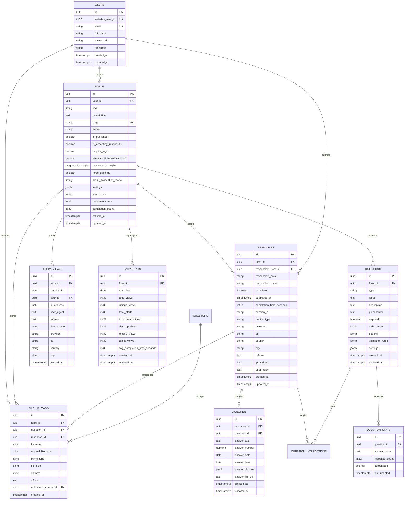

# Data Model & Database Schema

**Schema:** `form`
**Database:** PostgreSQL 15+
**ORM:** SQLC (type-safe query generation)

## Overview

Weladee Form uses PostgreSQL for persistent storage with a well-normalized schema optimized for form building, response collection, and analytics aggregation.

## Entity Relationship Diagram



## Table Details

### form.users

Form system users linked to Weladee platform accounts.

| Column | Type | Constraints | Description |
|--------|------|-------------|-------------|
| `id` | UUID | PRIMARY KEY | Internal user ID |
| `weladee_user_id` | INTEGER | UNIQUE, NOT NULL | External Weladee user ID |
| `email` | VARCHAR(255) | UNIQUE, NOT NULL | User email |
| `full_name` | VARCHAR(255) | nullable | Display name |
| `avatar_url` | TEXT | nullable | Profile picture URL |
| `timezone` | VARCHAR(100) | DEFAULT 'Asia/Bangkok' | User timezone |
| `created_at` | TIMESTAMPTZ | NOT NULL, DEFAULT NOW() | Account creation |
| `updated_at` | TIMESTAMPTZ | NOT NULL, DEFAULT NOW() | Last update |

**Indexes:**
- `weladee_user_id` (unique)

### form.forms

Form definitions with metadata and settings.

| Column | Type | Constraints | Description |
|--------|------|-------------|-------------|
| `id` | UUID | PRIMARY KEY | Form ID |
| `user_id` | UUID | FK → users.id, NOT NULL | Form owner |
| `title` | VARCHAR(500) | NOT NULL, DEFAULT 'Untitled Form' | Form title |
| `description` | TEXT | nullable | Form description |
| `slug` | VARCHAR(255) | UNIQUE | Public URL slug |
| `theme` | VARCHAR(50) | NOT NULL, CHECK | Visual theme |
| `is_published` | BOOLEAN | NOT NULL, DEFAULT false | Published status |
| `is_accepting_responses` | BOOLEAN | NOT NULL, DEFAULT true | Accepting responses |
| `require_login` | BOOLEAN | NOT NULL, DEFAULT false | Login required |
| `allow_multiple_submissions` | BOOLEAN | NOT NULL, DEFAULT false | Multiple responses |
| `progress_bar_style` | progress_bar_style | NOT NULL, DEFAULT 'none' | Progress indicator |
| `force_captcha` | BOOLEAN | NOT NULL, DEFAULT false | Require CAPTCHA |
| `email_notification_mode` | VARCHAR(20) | NOT NULL, CHECK | Email notifications |
| `settings` | JSONB | DEFAULT '{}' | Additional settings |
| `view_count` | INTEGER | DEFAULT 0 | View counter |
| `response_count` | INTEGER | DEFAULT 0 | Response counter |
| `completion_count` | INTEGER | DEFAULT 0 | Completion counter |
| `created_at` | TIMESTAMPTZ | NOT NULL, DEFAULT NOW() | Creation time |
| `updated_at` | TIMESTAMPTZ | NOT NULL, DEFAULT NOW() | Last update |

**Theme Values:** `minimal`, `midnight`, `ocean`, `sunset`, `forest`, `lavender`, `weladee`, `aurora`, `cyberpunk`, `desert`

**Progress Bar Styles:** `none`, `linear`, `steps`, `circular`

**Email Notification Modes:** `never`, `immediate`, `daily`

**Indexes:**
- `user_id` (form owner lookup)
- `is_published` (published forms list)
- `progress_bar_style` (filtering)

**Triggers:**
- `update_forms_updated_at` - Auto-update `updated_at` on row modification

### form.questions

Form questions with type-specific configurations.

| Column | Type | Constraints | Description |
|--------|------|-------------|-------------|
| `id` | UUID | PRIMARY KEY | Question ID |
| `form_id` | UUID | FK → forms.id, NOT NULL | Parent form |
| `type` | VARCHAR(50) | NOT NULL, CHECK | Question type |
| `label` | TEXT | NOT NULL | Question text |
| `description` | TEXT | nullable | Help text |
| `placeholder` | TEXT | nullable | Input placeholder |
| `required` | BOOLEAN | NOT NULL, DEFAULT false | Required field |
| `order_index` | INTEGER | NOT NULL | Display order |
| `options` | JSONB | nullable | Type options |
| `validation_rules` | JSONB | nullable | Validation rules |
| `settings` | JSONB | DEFAULT '{}' | Additional settings |
| `created_at` | TIMESTAMPTZ | NOT NULL, DEFAULT NOW() | Creation time |
| `updated_at` | TIMESTAMPTZ | NOT NULL, DEFAULT NOW() | Last update |

**Question Types:**
- `short_text` - Single line input
- `long_text` - Multi-line textarea
- `dropdown` - Select one
- `checkboxes` - Select multiple
- `email` - Email with validation
- `phone` - Phone number
- `number` - Numeric input
- `date` - Date picker
- `rating` - Star rating (1-5)
- `opinion_scale` - Numeric scale (1-10)
- `yes_no` - Binary choice
- `file_upload` - File upload (Enterprise only)
- `url` - Website URL
- `matrix` - Matrix question (Standard+)
- `ranking` - Ranking question (Enterprise only)

**Indexes:**
- `(form_id, order_index)` - Ordered question list

**Triggers:**
- `update_questions_updated_at` - Auto-update `updated_at`

### form.responses

Form submissions with analytics tracking.

| Column | Type | Constraints | Description |
|--------|------|-------------|-------------|
| `id` | UUID | PRIMARY KEY | Response ID |
| `form_id` | UUID | FK → forms.id, NOT NULL | Parent form |
| `respondent_user_id` | UUID | FK → users.id, nullable | Authenticated user |
| `respondent_email` | VARCHAR(255) | nullable | Email (anonymous) |
| `respondent_name` | VARCHAR(255) | nullable | Name (anonymous) |
| `completed` | BOOLEAN | NOT NULL, DEFAULT false | Completed status |
| `submitted_at` | TIMESTAMPTZ | nullable | Submission time |
| `completion_time_seconds` | INTEGER | nullable | Time to complete |
| `session_id` | VARCHAR(255) | nullable | Session identifier |
| `device_type` | VARCHAR(50) | nullable | Device type |
| `browser` | VARCHAR(100) | nullable | Browser name |
| `os` | VARCHAR(100) | nullable | Operating system |
| `country` | VARCHAR(2) | nullable | Country code |
| `city` | VARCHAR(255) | nullable | City name |
| `referrer` | TEXT | nullable | Referrer URL |
| `ip_address` | INET | nullable | IP address |
| `user_agent` | TEXT | nullable | User agent string |
| `created_at` | TIMESTAMPTZ | NOT NULL, DEFAULT NOW() | First interaction |
| `updated_at` | TIMESTAMPTZ | NOT NULL, DEFAULT NOW() | Last update |

**Indexes:**
- `form_id` (response lookup)
- `submitted_at DESC` (chronological order)
- `device_type` (analytics filtering)
- `completion_time_seconds` (performance analytics)

**Triggers:**
- `update_responses_updated_at` - Auto-update `updated_at`

### form.answers

Individual answers within responses.

| Column | Type | Constraints | Description |
|--------|------|-------------|-------------|
| `id` | UUID | PRIMARY KEY | Answer ID |
| `response_id` | UUID | FK → responses.id, NOT NULL | Parent response |
| `question_id` | UUID | FK → questions.id, NOT NULL | Answered question |
| `answer_text` | TEXT | nullable | Text answer |
| `answer_number` | NUMERIC | nullable | Number answer |
| `answer_date` | DATE | nullable | Date answer |
| `answer_time` | TIME | nullable | Time answer |
| `answer_choices` | JSONB | nullable | Multiple choice answer |
| `answer_file_url` | TEXT | nullable | File upload URL |
| `created_at` | TIMESTAMPTZ | NOT NULL, DEFAULT NOW() | Creation time |
| `updated_at` | TIMESTAMPTZ | NOT NULL, DEFAULT NOW() | Last update |

**Constraints:**
- `UNIQUE(response_id, question_id)` - One answer per question per response

**Indexes:**
- `response_id` (answer lookup)
- `question_id` (question analytics)

**Triggers:**
- `update_answers_updated_at` - Auto-update `updated_at`

### form.file_uploads

File upload metadata with S3 references.

| Column | Type | Constraints | Description |
|--------|------|-------------|-------------|
| `id` | UUID | PRIMARY KEY | Upload ID |
| `form_id` | UUID | FK → forms.id, NOT NULL | Parent form |
| `question_id` | UUID | FK → questions.id, NOT NULL | Upload question |
| `response_id` | UUID | FK → responses.id, nullable | Associated response |
| `filename` | VARCHAR(500) | NOT NULL | Storage filename |
| `original_filename` | VARCHAR(500) | NOT NULL | Original filename |
| `mime_type` | VARCHAR(100) | NOT NULL | MIME type |
| `file_size` | BIGINT | NOT NULL | File size in bytes |
| `s3_key` | VARCHAR(1000) | NOT NULL | S3 object key |
| `s3_url` | TEXT | NOT NULL | S3 URL |
| `uploaded_by_user_id` | UUID | FK → users.id, nullable | Uploader |
| `created_at` | TIMESTAMPTZ | NOT NULL, DEFAULT NOW() | Upload time |

**Indexes:**
- `form_id` (form-level queries)
- `response_id` (response lookup)

### form.form_views

Page view tracking for analytics.

| Column | Type | Constraints | Description |
|--------|------|-------------|-------------|
| `id` | UUID | PRIMARY KEY | View ID |
| `form_id` | UUID | FK → forms.id, NOT NULL | Viewed form |
| `session_id` | VARCHAR(255) | nullable | Session identifier |
| `user_id` | UUID | FK → users.id, nullable | Authenticated user |
| `ip_address` | INET | nullable | IP address |
| `user_agent` | TEXT | nullable | User agent string |
| `referrer` | TEXT | nullable | Referrer URL |
| `device_type` | VARCHAR(50) | nullable | Device type |
| `browser` | VARCHAR(100) | nullable | Browser name |
| `os` | VARCHAR(100) | nullable | Operating system |
| `country` | VARCHAR(2) | nullable | Country code |
| `city` | VARCHAR(255) | nullable | City name |
| `viewed_at` | TIMESTAMPTZ | NOT NULL, DEFAULT NOW() | View time |

**Indexes:**
- `form_id` (form analytics)
- `session_id` (unique view tracking)
- `viewed_at DESC` (time-series queries)

### form.daily_stats

Aggregated daily statistics per form.

| Column | Type | Constraints | Description |
|--------|------|-------------|-------------|
| `id` | UUID | PRIMARY KEY | Stat ID |
| `form_id` | UUID | FK → forms.id, NOT NULL | Form |
| `stat_date` | DATE | NOT NULL | Stat date |
| `total_views` | INTEGER | DEFAULT 0 | Total views |
| `unique_views` | INTEGER | DEFAULT 0 | Unique views |
| `total_starts` | INTEGER | DEFAULT 0 | Form starts |
| `total_completions` | INTEGER | DEFAULT 0 | Completions |
| `desktop_views` | INTEGER | DEFAULT 0 | Desktop views |
| `mobile_views` | INTEGER | DEFAULT 0 | Mobile views |
| `tablet_views` | INTEGER | DEFAULT 0 | Tablet views |
| `avg_completion_time_seconds` | INTEGER | nullable | Avg completion |
| `created_at` | TIMESTAMPTZ | NOT NULL, DEFAULT NOW() | Creation time |
| `updated_at` | TIMESTAMPTZ | NOT NULL, DEFAULT NOW() | Last update |

**Constraints:**
- `UNIQUE(form_id, stat_date)` - One stat row per form per day

**Indexes:**
- `(form_id, stat_date DESC)` - Time-series lookups

### form.question_stats

Answer distribution for analytics.

| Column | Type | Constraints | Description |
|--------|------|-------------|-------------|
| `id` | UUID | PRIMARY KEY | Stat ID |
| `question_id` | UUID | FK → questions.id, NOT NULL | Question |
| `answer_value` | TEXT | NOT NULL | Answer value |
| `response_count` | INTEGER | DEFAULT 0 | Count |
| `percentage` | DECIMAL(5,2) | nullable | Percentage |
| `last_updated` | TIMESTAMPTZ | NOT NULL, DEFAULT NOW() | Last update |

**Constraints:**
- `UNIQUE(question_id, answer_value)` - One row per answer value

**Indexes:**
- `question_id` (question analytics)

## Database Functions

### update_updated_at_column()

Automatically updates `updated_at` timestamp on row modification.

```sql
CREATE OR REPLACE FUNCTION form.update_updated_at_column()
RETURNS TRIGGER AS $$
BEGIN
    NEW.updated_at = NOW();
    RETURN NEW;
END;
$$ LANGUAGE plpgsql;
```

Applied to all major tables via triggers.

## SQLC Integration

SQLC generates type-safe Go code from SQL queries.

**Query Location:** `sql/queries/*.sql`

**Generated Code:** `internal/db/sqlc/*.sql.go`

**Example Usage:**
```go
// Type-safe query execution
form, err := queries.GetForm(ctx, formID)

// With parameters
forms, err := queries.ListUserForms(ctx, db.ListUserFormsParams{
    UserID: userID,
    Limit:  50,
    Offset: 0,
})
```

## Database Migrations

Migrations are stored in `sql/schema/` and applied manually or via migration tools.

**Current Schema:** `sql/schema/form_schema.sql`

**Key Features:**
- Idempotent (uses `IF NOT EXISTS`)
- Single transaction per migration
- Cascade deletes for data integrity
- Automatic `updated_at` triggers

## Performance Considerations

### Indexes

- Foreign keys indexed for JOIN performance
- Composite indexes for common query patterns
- DESC indexes for time-series queries

### JSONB Fields

- `settings`, `options`, `validation_rules` use JSONB for flexibility
- GIN indexes can be added if JSON querying becomes common

### Cascade Deletes

- `ON DELETE CASCADE` for dependent data
- `ON DELETE SET NULL` for optional relationships

### Connection Pooling

Managed by `pgx/v5` driver in `internal/db/database.go`

---

**Next:** [Security Architecture](./05-security.md)
