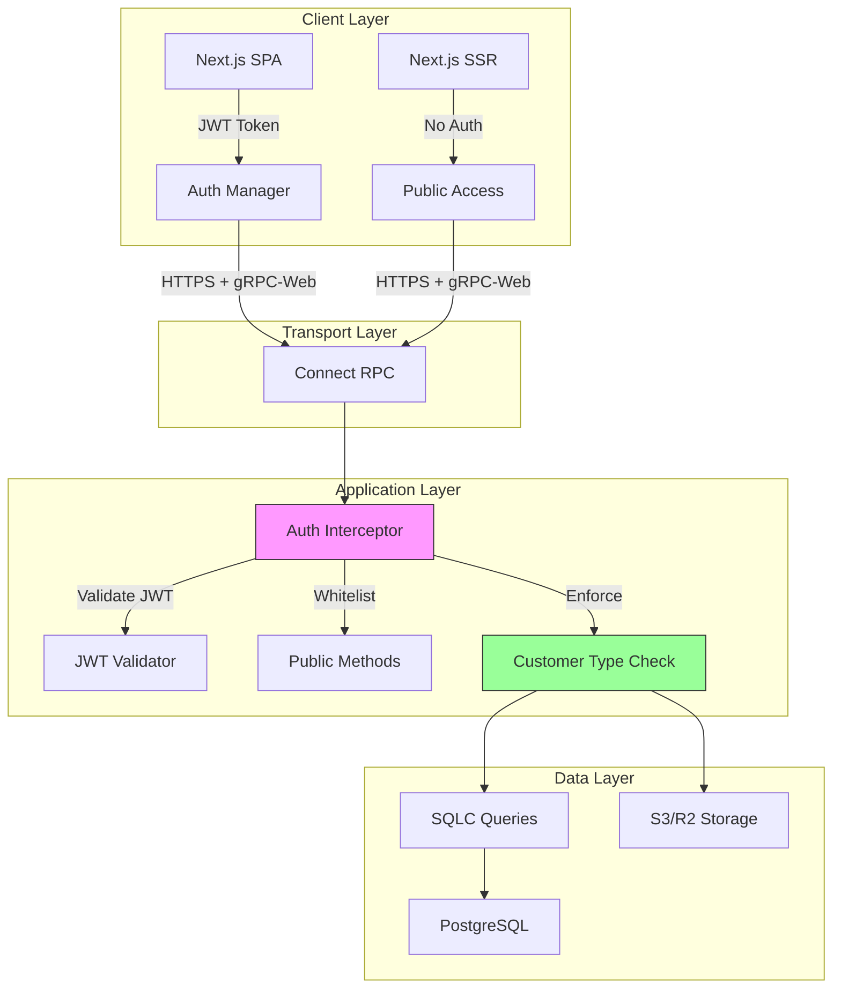
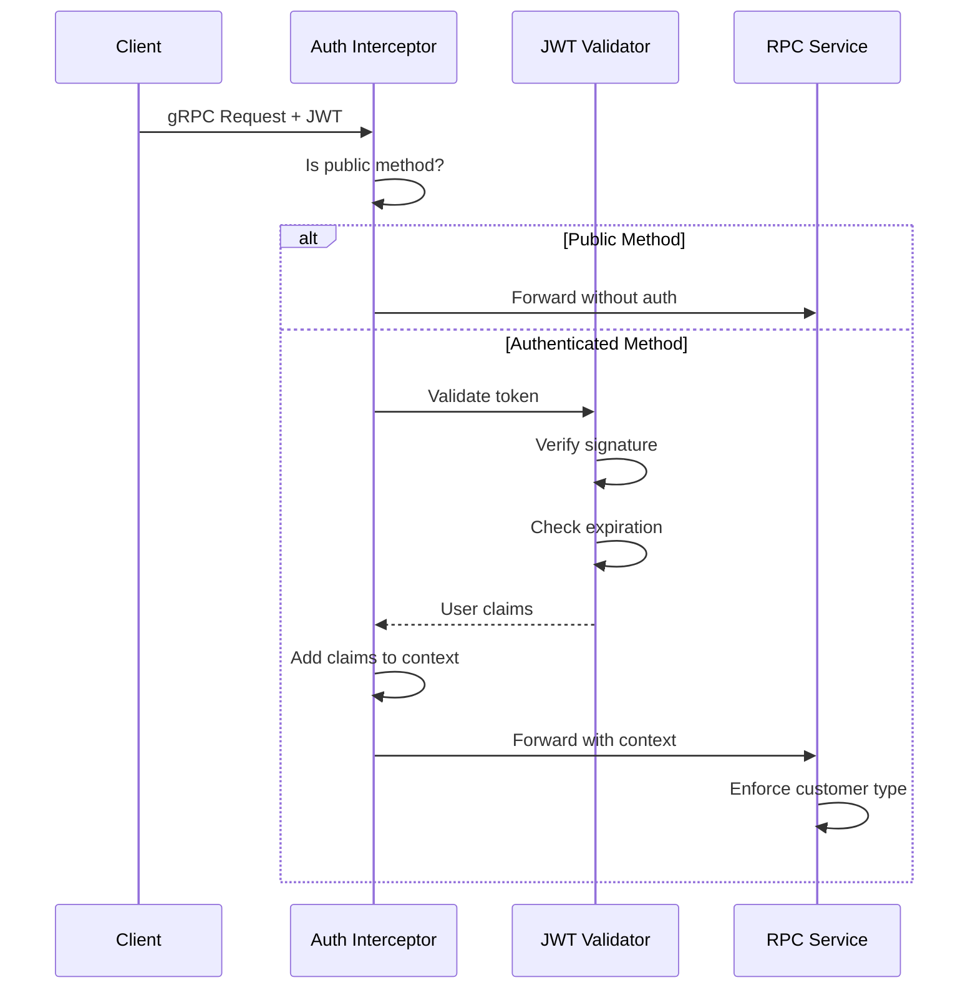

# Security Architecture

**Security Model:** JWT-based authentication with customer tier enforcement
**Threat Model:** Public form access, authenticated management, anonymous submissions

## Overview

Weladee Form implements defense-in-depth security with JWT authentication, customer type enforcement, input validation, and secure storage practices.

## Security Layers



## Authentication Flow

### JWT Token Structure

**Algorithm:** RS256 (RSA Signature with SHA-256)

**Claims:**
```json
{
  "user_id": 123,
  "email": "user@example.com",
  "display_name": "John Doe",
  "role": "admin",
  "customer_type": "enterprise",
  "logo_url": "https://company.com/logo.png",
  "exp": 1704067200,
  "iat": 1703980800
}
```

**Customer Types:**
- `sme` - Small business (5 forms max, limited question types)
- `standard` - Standard plan (15 forms max, more question types)
- `enterprise` - Enterprise (unlimited forms, all features)

### Token Validation Flow



### Public vs Authenticated Endpoints

**Public (No Auth Required):**
```
GET /f/[slug]                          - View public form
FormService.GetFormBySlug              - Fetch form by slug
ResponseService.SubmitResponse         - Submit response
AnalyticsService.TrackView             - Track view
AnalyticsService.TrackResponseStart    - Track start
```

**Authenticated (JWT Required):**
```
FormService.CreateForm                 - Create form
FormService.UpdateForm                 - Update form
FormService.ListForms                  - List user's forms
ResponseService.ListResponses          - View responses
ResponseService.ExportResponses        - Export data
FileService.UploadFile                 - Upload files
```

**Implementation:** `internal/auth/interceptor.go`

## Customer Type Enforcement

### Backend Enforcement (Go)

```go
// File: internal/gapi/rpc_form.go

func (s *FormService) CreateForm(ctx context.Context, req *pb.CreateFormRequest) (*pb.CreateFormResponse, error) {
    claims := auth.GetUserClaims(ctx)

    // Check form creation limit
    count, _ := s.queries.CountUserForms(ctx, claims.UserID)
    maxForms := getMaxFormsForCustomerType(claims.CustomerType)
    if count >= maxForms {
        return nil, status.Error(codes.ResourceExhausted,
            "form limit reached for your plan")
    }

    // Create form...
}

func getMaxFormsForCustomerType(t string) int64 {
    switch t {
    case "sme": return 5
    case "standard": return 15
    case "enterprise": return math.MaxInt64
    default: return 5
    }
}
```

### Question Type Restrictions

```go
func (s *FormService) CreateQuestion(ctx context.Context, req *pb.CreateQuestionRequest) (*pb.CreateQuestionResponse, error) {
    claims := auth.GetUserClaims(ctx)

    switch req.Type {
    case pb.QuestionType_QUESTION_TYPE_FILE_UPLOAD:
        if claims.CustomerType != "enterprise" {
            return nil, status.Error(codes.PermissionDenied,
                "file upload requires enterprise plan")
        }

    case pb.QuestionType_QUESTION_TYPE_MATRIX:
        if claims.CustomerType == "sme" {
            return nil, status.Error(codes.PermissionDenied,
                "matrix questions require standard or enterprise plan")
        }

    case pb.QuestionType_QUESTION_TYPE_RANKING:
        if claims.CustomerType != "enterprise" {
            return nil, status.Error(codes.PermissionDenied,
                "ranking questions require enterprise plan")
        }
    }

    // Create question...
}
```

### Frontend Enforcement (TypeScript)

```typescript
// File: components/form-builder/form-builder.tsx

const AVAILABLE_QUESTION_TYPES = useMemo(() => {
    return QUESTION_TYPES.filter(type => {
        switch (customerType) {
            case 'sme':
                return !['file_upload', 'matrix', 'ranking'].includes(type.value)
            case 'standard':
                return !['file_upload', 'ranking'].includes(type.value)
            case 'enterprise':
                return true
            default:
                return true
        }
    })
}, [customerType])
```

### Feature Matrix

| Feature | SME | Standard | Enterprise |
|---------|-----|----------|------------|
| Max Forms | 5 | 15 | Unlimited |
| short_text | ✅ | ✅ | ✅ |
| long_text | ✅ | ✅ | ✅ |
| dropdown | ✅ | ✅ | ✅ |
| checkboxes | ✅ | ✅ | ✅ |
| email | ✅ | ✅ | ✅ |
| phone | ✅ | ✅ | ✅ |
| number | ✅ | ✅ | ✅ |
| date | ✅ | ✅ | ✅ |
| rating | ✅ | ✅ | ✅ |
| opinion_scale | ✅ | ✅ | ✅ |
| yes_no | ✅ | ✅ | ✅ |
| url | ✅ | ✅ | ✅ |
| **file_upload** | ❌ | ❌ | ✅ |
| **matrix** | ❌ | ✅ | ✅ |
| **ranking** | ❌ | ❌ | ✅ |
| Company Branding | ❌ | ❌ | ✅ |
| Export to CSV | ✅ | ✅ | ✅ |
| Export to JSON | ✅ | ✅ | ✅ |
| Export to Excel | ❌ | ❌ | ✅ |

## Input Validation

### Backend Validation

```go
// SQLC provides type safety for database operations
type CreateFormParams struct {
    UserID    uuid.UUID
    Title     string        // Max 500 chars via DB constraint
    Theme     string        // ENUM check via DB constraint
    Settings  jsonb.RawMessage
}

// Additional validation in service layer
if len(req.Title) == 0 || len(req.Title) > 500 {
    return nil, status.Error(codes.InvalidArgument, "title must be 1-500 characters")
}

validThemes := map[string]bool{
    "minimal": true, "midnight": true, "ocean": true,
    // ...
}
if !validThemes[req.Theme] {
    return nil, status.Error(codes.InvalidArgument, "invalid theme")
}
```

### Frontend Validation

```typescript
// Client-side validation for immediate feedback
const validateQuestion = (question: Question): string[] => {
    const errors: string[] = []

    if (!question.label || question.label.trim().length === 0) {
        errors.push('Question label is required')
    }

    if (question.type === 'email') {
        const emailRegex = /^[^\s@]+@[^\s@]+\.[^\s@]+$/
        if (answer && !emailRegex.test(answer)) {
            errors.push('Invalid email format')
        }
    }

    return errors
}
```

## File Upload Security

### File Type Validation

```go
// Server-side validation
allowedMimeTypes := map[string]bool{
    "image/jpeg": true,
    "image/png": true,
    "image/gif": true,
    "application/pdf": true,
}

if !allowedMimeTypes[req.MimeType] {
    return nil, status.Error(codes.InvalidArgument, "invalid file type")
}
```

### File Size Limits

```go
const MaxFileSize = 10 * 1024 * 1024 // 10MB

if req.FileSize > MaxFileSize {
    return nil, status.Error(codes.ResourceExhausted, "file too large")
}
```

### Storage Security

- **S3/R2 Encryption:** Server-side encryption enabled
- **Presigned URLs:** Time-limited access tokens
- **Private Buckets:** No public read access
- **Key Scoping:** Files scoped to form/question/response

## CAPTCHA Integration

### Google reCAPTCHA v3

**Configuration:** `config/config.go`

```yaml
recaptcha:
  enabled: true
  site_key: "6Lxxxxxxxxxxxxxxxx"
  secret_key: "6Lxxxxxxxxxxxxxxxx"
  threshold: 0.5  # 0.0-1.0, higher = stricter
```

**Implementation:** `internal/utils/recaptcha.go`

```go
func VerifyRecaptcha(token string) (float64, error) {
    resp, err := http.PostForm(
        "https://www.google.com/recaptcha/api/siteverify",
        url.Values{
            "secret": {recaptchaConfig.SecretKey},
            "response": {token},
        },
    )

    var result RecaptchaResponse
    json.NewDecoder(resp.Body).Decode(&result)

    if result.Score < recaptchaConfig.Threshold {
        return result.Score, errors.New("score below threshold")
    }

    return result.Score, nil
}
```

**Per-Form Control:**
- Form builder has "Force CAPTCHA" toggle
- Stored in `form.forms.force_captcha`
- Enforced in `SubmitResponse` RPC

## Data Security

### Database Security

1. **Connection Security**
   - SSL/TLS required for database connections
   - Connection pooling via `pgx/v5`

2. **Row-Level Security (Future)**
   - Users can only access their own forms
   - Responses isolated by form_id

3. **SQL Injection Prevention**
   - SQLC generates parameterized queries
   - No string concatenation in SQL

### API Security

1. **Authentication**
   - JWT required for all non-public endpoints
   - Token validation on every request

2. **Authorization**
   - Customer type enforcement at service layer
   - Resource ownership validation

3. **Rate Limiting (Future)**
   - Per-user rate limits
   - Per-form rate limits

### Storage Security

1. **S3/R2**
   - Private buckets (no public access)
   - Presigned URLs with expiration
   - Server-side encryption

2. **File Metadata**
   - MIME type validation
   - File size limits
   - Virus scanning (future)

## Privacy & GDPR

### Data Collection

- **Form Views:** IP, user agent, referrer (analytics)
- **Responses:** Email/name (optional, if provided)
- **Files:** Original filename, MIME type, size

### Data Deletion

```sql
-- Cascade deletes configured
ON DELETE CASCADE for:
- questions → form
- responses → form
- answers → response
- file_uploads → response
```

### Data Access

- Form owners can view all their form data
- Users can export their data (CSV/JSON/Excel)
- Admin access requires admin role

## Security Best Practices

### Implemented

- ✅ JWT authentication with RS256
- ✅ Customer type enforcement (backend + frontend)
- ✅ Input validation (both sides)
- ✅ SQL injection prevention (SQLC)
- ✅ File type/size validation
- ✅ HTTPS required for all API calls
- ✅ Public endpoint whitelist

### Future Enhancements

- ⏳ Rate limiting per user/form
- ⏳ CSRF protection for state-changing operations
- ⏳ Content Security Policy (CSP) headers
- ⏳ Subresource Integrity (SRI) for scripts
- ⏳ Security headers (HSTS, X-Frame-Options)
- ⏳ Audit logging for sensitive operations
- ⏳ Row-level security in database
- ⏳ API key authentication for integrations

---

**Next:** [Quality Attributes](./06-quality-attributes.md)
