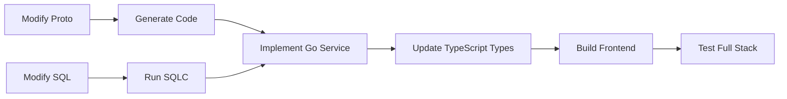

# Weladee Form - Architecture Documentation

**Version:** 1.0.0
**Last Updated:** 2025-01-08
**Status:** Active Development (feature/grpc-migration branch)

## Overview

Weladee Form is an open-source TypeForm alternative built with a modern full-stack architecture emphasizing type safety, performance, and developer experience.

### Tech Stack

| Layer | Technology | Purpose |
|-------|-----------|---------|
| **Frontend** | Next.js 16 + React 19 | App Router, Server Components, SSR |
| **Backend** | Go 1.21+ + gRPC | High-performance RPC API |
| **Database** | PostgreSQL 15+ | Relational data storage |
| **ORM** | SQLC | Type-safe SQL code generation |
| **Protocol** | Protobuf v3 | API contract definition |
| **Transport** | gRPC-Web / Connect RPC | Browser-to-server communication |
| **Storage** | S3 / R2 | File upload storage |
| **Auth** | JWT (RS256) | Token-based authentication |

## Documentation Structure

```
docs/architecture/
├── README.md                 # This file - overview and navigation
├── 01-system-context.md      # C4 Level 1: System context
├── 02-containers.md          # C4 Level 2: Container architecture
├── 03-components.md          # C4 Level 3: Component breakdown
├── 04-data-model.md          # Database schema and ER diagrams
├── 05-security.md            # Security architecture
├── 06-quality-attributes.md  # Performance, scalability, maintainability
├── 07-deployment.md          # Deployment architecture
├── api/                      # API documentation
│   ├── grpc-services.md      # gRPC service definitions
│   ├── auth-flow.md          # Authentication flow
│   └── error-handling.md     # Error handling patterns
├── diagrams/                 # Mermaid diagrams source
│   ├── c4-context.mmd
│   ├── c4-containers.mmd
│   ├── c4-components.mmd
│   └── data-flow.mmd
└── adr/                      # Architecture Decision Records
    ├── 001-grpc-over-rest.md
    ├── 002-sqlc-over-orm.md
    ├── 003-nextjs-app-router.md
    ├── 004-protobuf-types.md
    └── 005-connect-protocol.md
```

## Quick Reference

### Key Architecture Patterns

1. **Clean Architecture** - Layered backend with clear separation of concerns
2. **C4 Model** - Structured documentation at multiple abstraction levels
3. **Type-Safe First** - Protobuf + SQLC for end-to-end type safety
4. **Single Binary** - Go server with embedded Next.js build
5. **Public-Private Split** - Separate routing for authenticated and public access

### Important Files

| File | Purpose |
|------|---------|
| `proto/*.proto` | gRPC service definitions |
| `sql/schema/form_schema.sql` | Database schema |
| `internal/gapi/*.go` | gRPC service implementations |
| `internal/auth/interceptor.go` | Authentication middleware |
| `lib/grpc-client.ts` | Frontend gRPC client |
| `components/form-builder/` | Form editor UI |
| `components/form-player/` | Public form renderer |

### Customer Type Enforcement

The system enforces feature restrictions based on customer tier:

| Feature | SME | Standard | Enterprise |
|---------|-----|----------|------------|
| Max Forms | 5 | 15 | Unlimited |
| File Uploads | ❌ | ❌ | ✅ |
| Matrix Questions | ❌ | ✅ | ✅ |
| Ranking Questions | ❌ | ❌ | ✅ |
| Company Branding | ❌ | ❌ | ✅ |
| Excel Export | ❌ | ❌ | ✅ |

See [Customer Type Enforcement](../CLAUDE.md#customer-type-enforcement) for implementation details.

## Architecture Principles

1. **Type Safety Over Convenience** - Use code generation (Protobuf, SQLC) to prevent entire classes of bugs
2. **Performance First** - gRPC binary protocol, prepared statements, connection pooling
3. **Developer Experience** - Hot reload, clear errors, comprehensive documentation
4. **Security by Default** - JWT validation, customer type enforcement, input sanitization
5. **Open Source Ready** - Clear architecture for community contributions

## Development Workflow



## Contributing

When making architectural changes:

1. Update the relevant ADR in `adr/`
2. Update diagrams in `diagrams/`
3. Run `make db-generate` after SQL changes
4. Run `make proto` after proto changes
5. Update this README if the change affects high-level architecture

## License

This architecture documentation is part of the Weladee Form project.

---

**Next:** [System Context (C4 Level 1)](./01-system-context.md)
